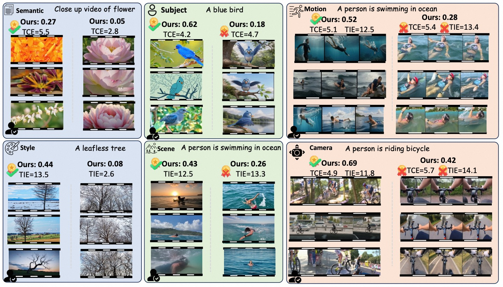
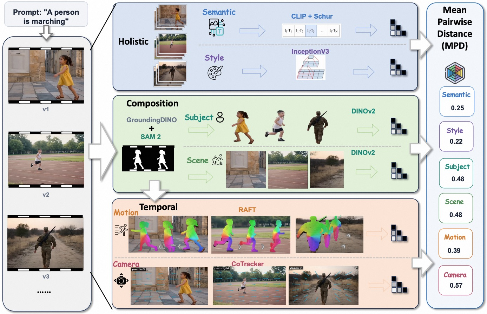
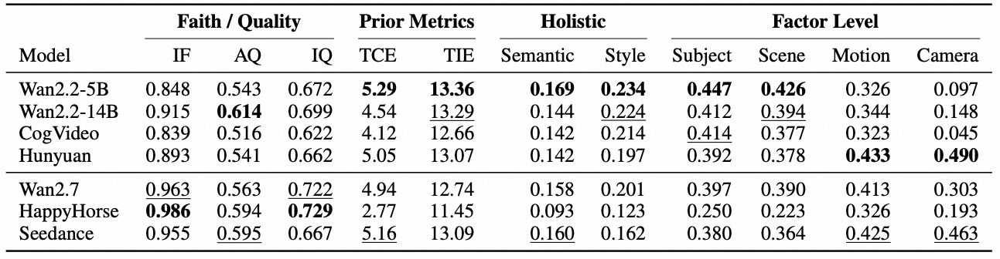

# DiVid: Diagnosing Dimension-Specific Diversity Collapse in Video Generation Models


Despite remarkable progress, video generation models often produce highly similar outputs when repeatedly sampled from the same prompt, a homogenization phenomenon obscured by existing global diversity metrics. To address this, we introduce **DiVid**, a dimension-level diagnostic framework that decomposes video generation diversity into six interpretable spatiotemporal dimensions: Semantic, Style, Subject, Scene, Motion, and Camera. By systematically evaluating representative models using our reproducible vision pipelines, we reveal that diversity is highly dimension-specific—models with strong overall diversity can still exhibit severe collapse in specific factors like temporal dynamics, exposing fundamental bottlenecks such as default mode convergence and realization gaps.

**Key Contributions:**
* **Six-Dimensional Diagnostic Framework:** Decomposes video diversity into holistic dimensions (Semantic, Style) and factor-level dimensions (Subject, Scene, Motion, Camera) for localized and interpretable diagnosis.
* **Reproducible Evaluation Pipelines:** Utilizes state-of-the-art vision models (GroundingDINO, SAM 2, DINOv2, CoTracker, RAFT) to compute Mean Pairwise Distance (MPD) and Vendi scores for fine-grained diversity measurement.
* **New Benchmarking Insights:** Demonstrates that current frontier video generation models suffer from severe dimension-specific diversity collapse, proving that high global diversity does not guarantee variation in individual temporal or spatial factors.
* **Bottleneck Identification:** Employs controlled prompt interventions to uncover two primary behavioral causes of homogenization: *default mode convergence* (falling back to training priors under open prompts) and *realization gaps* (failing to faithfully execute explicit diverse instructions).





Arxiv link: coming soon.

## Table of Contents
- [Method](#method)
- [Installation](#installation)
- [Model Weights](#model-weights)
- [Usage](#usage)
  - [Evaluate a Video Directory](#evaluate-a-video-directory)
  - [Pass Video Paths Directly](#pass-video-paths-directly)
  - [Evaluate Selected Dimensions](#evaluate-selected-dimensions)
- [Output](#output)
- [Python API](#python-api)
- [License](#license)

# DiVid

DiVid is a six-dimensional diversity evaluator for text-to-video generation. Given a prompt and a set of `k >= 2` videos generated from that prompt, it returns Mean Pairwise Distance (MPD) for:

```text
semantic, style, subject, scene, motion, camera
```

MPD is the mean distance over all video pairs for one prompt. A higher score indicates more variation along the corresponding dimension. The evaluator also returns a Vendi score and the underlying similarity matrix for each requested dimension.

## Method

- **Semantic**: builds a prompt-conditioned kernel from OpenCLIP video and text features, removing the shared prompt-alignment component.
- **Style**: compares InceptionV3 pool3 video features to measure variation in composition, texture, color, lighting, and appearance.
- **Subject**: localizes subjects with GroundingDINO, tracks masks with SAM 2, and encodes subject crops with DINOv2.
- **Scene**: reuses the subject masks, suppresses the subject region, and encodes the surrounding scene with DINOv2.
- **Motion v4.1**: extracts subject-relative trajectories with CoTracker and non-rigid deformation with RAFT after subject canonicalization; the two RBF kernels are combined with equal weight.
- **Camera v3**: tracks background points with CoTracker and fits global affine/homography transforms with RANSAC to measure camera translation, scale, rotation, and related changes.

Subject, Scene, Motion, and Camera share subject localization but use different downstream regions and descriptors. Subject encodes the foreground, Scene encodes the subject-suppressed background, Motion measures subject-relative movement, and Camera measures global background motion.

## Installation

Python 3.10 or newer is recommended. Install a PyTorch build compatible with your CUDA version before running GPU evaluation.

```bash
git clone https://github.com/your-org/DiVid.git
cd DiVid
python -m venv .venv
source .venv/bin/activate
python -m pip install --upgrade pip
python -m pip install -e .
python -m pip install git+https://github.com/facebookresearch/co-tracker.git
```

## Model Weights

OpenCLIP and Hugging Face models can be downloaded automatically by their respective libraries. For reproducible appearance and motion evaluation, place the following checkpoints in the project `models/` directory:

| Model | Download |
| --- | --- |
| InceptionV3 | [PyTorch checkpoint](https://download.pytorch.org/models/inception_v3_google-0cc3c7bd.pth) |
| RAFT-Large | [PyTorch checkpoint](https://download.pytorch.org/models/raft_large_C_T_SKHT_V2-ff5fadd5.pth) |
| CoTracker3 scaled offline | [Hugging Face checkpoint](https://huggingface.co/facebook/cotracker3/resolve/main/scaled_offline.pth) |
| GroundingDINO | [Hugging Face model](https://huggingface.co/IDEA-Research/grounding-dino-base) |
| SAM 2.1 | [Hugging Face model](https://huggingface.co/facebook/sam2.1-hiera-large) |
| DINOv2 | [Hugging Face model](https://huggingface.co/facebook/dinov2-large) |

Example downloads for the manually managed checkpoints:

```bash
mkdir -p models
wget -O models/inception_v3_google-0cc3c7bd.pth \
  https://download.pytorch.org/models/inception_v3_google-0cc3c7bd.pth
wget -O models/raft_large_C_T_SKHT_V2-ff5fadd5.pth \
  https://download.pytorch.org/models/raft_large_C_T_SKHT_V2-ff5fadd5.pth
wget -O models/scaled_offline.pth \
  https://huggingface.co/facebook/cotracker3/resolve/main/scaled_offline.pth
```

The third-party models and weights remain subject to their own licenses and terms of use.

## Usage

### Evaluate a Video Directory

Place at least two videos generated from the same prompt in one directory:

```bash
python -m divid.cli \
  --video-dir ./videos/example \
  --prompt "A dog running through a snowy forest" \
  --subjects "a dog" \
  --output ./results/example.json
```

Use one `--subjects` argument for each relevant subject:

```bash
python -m divid.cli \
  --video-dir ./videos/example \
  --prompt "Two dogs playing with a red ball in a park" \
  --subjects "a dog" "a red ball"
```

Without `--subjects`, the full prompt is used as the GroundingDINO query. For complex prompts, explicit short subject phrases are recommended.

### Pass Video Paths Directly

```bash
python -m divid.cli \
  --videos ./videos/a.mp4 ./videos/b.mp4 ./videos/c.mp4 \
  --prompt "A red car turning on a city street" \
  --subjects "a red car"
```

### Evaluate Selected Dimensions

```bash
python -m divid.cli \
  --video-dir ./videos/example \
  --prompt "A bird flying over a lake" \
  --subjects "a bird" \
  --dimensions semantic style motion camera \
  --device cuda
```

Use `--device cpu` on a machine without a GPU. Subject, Scene, Motion, and Camera evaluation are substantially slower on CPU.

## Output

The command writes JSON containing the prompt, video count, and per-dimension scores:

```json
{
  "prompt": "...",
  "video_count": 10,
  "semantic_mpd": 0.21,
  "style_mpd": 0.34,
  "subject_mpd": 0.18,
  "scene_mpd": 0.27,
  "motion_mpd": 0.15,
  "camera_mpd": 0.09
}
```

MPD values should be compared within the same dimension, prompt, and video count; absolute MPD values should not be compared across dimensions. This repository contains only the six-dimensional diversity core and does not include quality, faithfulness, or legacy dynamic metrics.

## Python API

```python
from divid import evaluate

scores = evaluate(
    ["videos/a.mp4", "videos/b.mp4", "videos/c.mp4"],
    "A cat jumping onto a chair",
    subjects=["a cat"],
    device="cuda",
)
print(scores["semantic_mpd"], scores["camera_mpd"])
```

## License

DiVid code is released under the MIT License. GroundingDINO, SAM 2, DINOv2, CoTracker, OpenCLIP, InceptionV3, and RAFT code and weights remain subject to their respective licenses.
